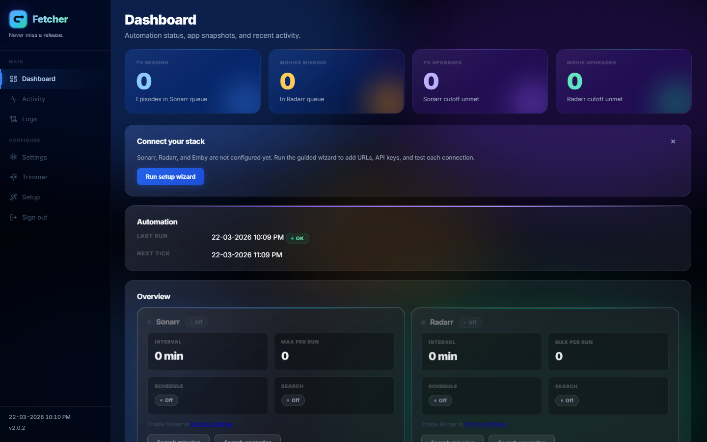
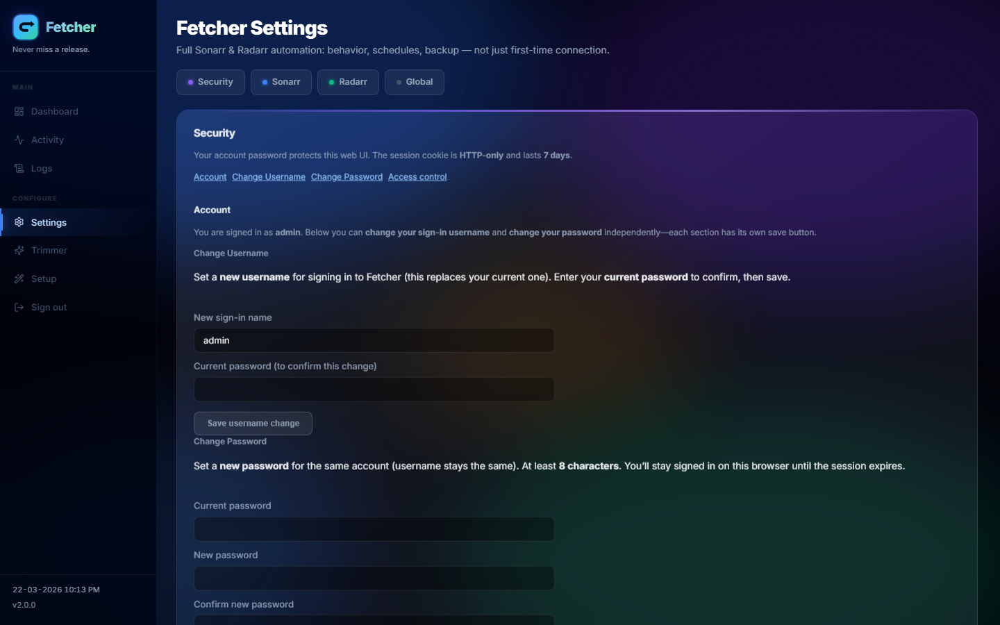
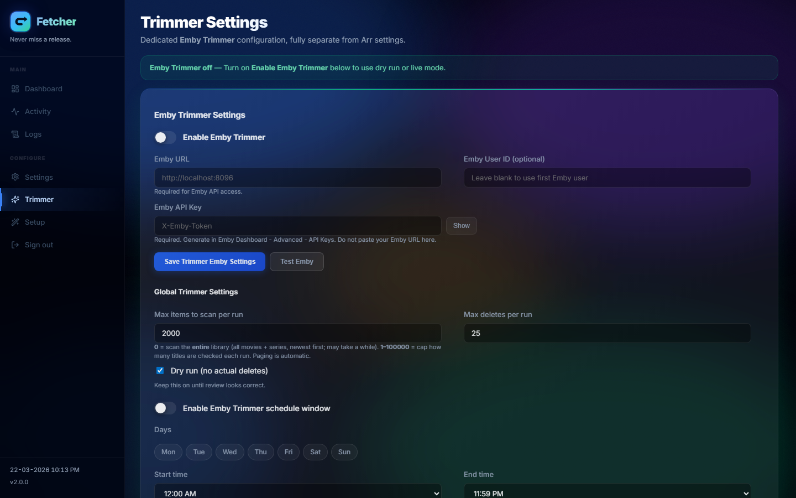
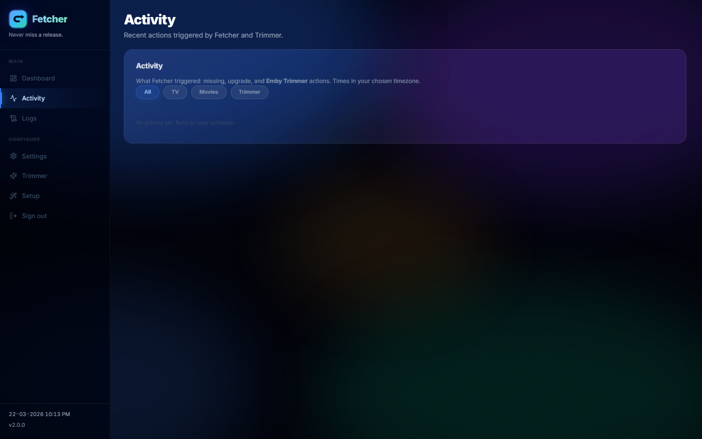

# Fetcher

Fetcher is a small **Windows-first** web app (FastAPI + SQLite + background scheduler) that talks to **Sonarr**, **Radarr**, and optionally **Emby** on your network. It runs as a **64-bit Windows service** installed with **`FetcherSetup.exe`** (Inno Setup), or in **Docker** on Linux (`ghcr.io/jampat000/fetcher`). The UI is plain HTML with a bit of glass-style polish—nothing fancy, but it’s meant to be readable day to day.

Fetcher is a production-ready automation service for Sonarr, Radarr, and Emby, focused on accurate monitored-missing progression and truthful system state reporting.

**How we build:** Fetcher is **production-grade**, and intentionally **“vibe-coded”** for what it is: automation you run in a **single-user, controlled environment** on your own network. It was built **quickly and deliberately**—not to carry legacy baggage or to over-engineer for hypothetical scale. Startup, schema, and errors stay strict; the codebase stays **small, inspectable, and dependable** day to day.

**What it’s for:** automate **missing** and **upgrade (cutoff)** searches on a schedule, keep an eye on **what ran and when**, and optionally drive **Emby Trimmer** rules (scan, review, apply) from the same place. Sonarr and Radarr still own your library; Fetcher just calls their APIs on your behalf. Emby is the playback server Trimmer uses to find candidates against your rules.

**License:** [MIT](LICENSE) · **Security:** [SECURITY.md](SECURITY.md) · **Contributing:** [CONTRIBUTING.md](CONTRIBUTING.md) · **Install / ops detail:** [docs/INSTALL-AND-OPERATIONS.md](docs/INSTALL-AND-OPERATIONS.md)

---

## Core features

- **Missing & upgrade automation** — scheduled (and manual) searches for monitored items without files and for cutoff-unmet queues, with **per-app Retry Delay** so you’re not hammering the same items every tick.
- **Dashboard** — per-app last/next run, live-style queue counts when Arr is reachable, and short hints from the last service run (including retry-delay context where it applies).
- **Activity & job logs** — human-readable summaries; logs page reads the same log directory the service writes to.
- **Failed import cleanup** — optional Sonarr/Radarr: removes **terminal** failed imports from each app’s **download queue** (queue API delete with **blocklist** attempted on the same request, then **queue-only** removal if that fails). Fetcher does **not** enable **remove-from-client**. Successful removals appear in **Activity** as **Failed import cleaned up** or **Failed import removed**; waiting/unknown/no-op paths do not add cleanup rows. See **[Failed import cleanup matrix](#failed-import-cleanup-matrix-sonarr--radarr)** below.
- **Setup wizard** — shown until real configuration is in place (password + at least one integration configured the way the app checks it). No separate “I’m done” flag; it’s driven by saved state.
- **Auth** — password (bcrypt), session cookie, optional IP allowlist; JSON API can use **Bearer access tokens** from the auth endpoints.
- **Backup / restore** — settings JSON from the UI (treat it as secret).

---

## Requirements

- **Windows (installed service):** 64-bit Windows; installer bundles the app and WinSW. You need **Sonarr** and/or **Radarr** (and **Emby** if you use Trimmer) reachable on your LAN; Fetcher stores **base URLs and API keys** you provide.
- **Python (from source / dev only):** see **Development** at the bottom; the shipped product does not require a system Python install.
- **Network:** the service listens on **TCP 8765** by default (`0.0.0.0` in the packaged service so other PCs on the LAN can open the UI—tighten with firewall or `--host 127.0.0.1` if you want loopback only).

---

## Failed import cleanup matrix (Sonarr & Radarr)

In **Settings → Sonarr** and **Settings → Radarr**, under **Search and cleanup**, each app has the same **five failure types**. Each row has its own **Remove** and **Blocklist** checkboxes (`sonarr_*` / `radarr_*` column names in backups). The legacy single “remove failed imports” master toggles still turn **all** five pairs on when enabled.

| Settings label | Internal scenario | Remove / blocklist field suffix |
| --- | --- | --- |
| Corrupt / unreadable file | `corrupt` | `_cleanup_corrupt` / `_blocklist_corrupt` |
| Download failed (client) | `download_failed` | `_cleanup_download_failed` / `_blocklist_download_failed` |
| Import failed (other / unclassified) | `import_failed` | `_cleanup_import_failed` / `_blocklist_import_failed` |
| Unmatched / manual import | `unmatched` | `_cleanup_unmatched` / `_blocklist_unmatched` |
| Not an upgrade / quality | `quality` | `_cleanup_quality` / `_blocklist_quality` |

**How rows are matched**

- **History pass:** walks Radarr/Sonarr **history** with a `downloadId`, then finds the **queue** row(s) with the same id. **`downloadFailed`** events map to **Download failed**. **`importFailed`** events use reason text: **quality → unmatched → corrupt** (including read-file-with-media-hint); anything still unclassified uses **Import failed (other)**. **Pending / waiting** (“downloaded, waiting to import, no eligible files…”) is **never** removed.
- **Queue pass:** any queue row not already removed; same **quality → unmatched → corrupt → download failed → generic import failed** order on **`errorMessage` / `statusMessages`**. **Download failed** also applies when **`trackedDownloadState`** is **failed** and nothing else matched.
- **Ambiguous `downloadId`:** if **more than one** distinct queue id shares the same `downloadId`, **history-driven** cleanup skips that id (conservative); the **queue** pass can still remove rows individually when their own text/state classifies.

Phrase lists differ slightly between **Radarr** (movies) and **Sonarr** (episodes); behavior is otherwise parallel.

**Why a title can still appear in *arr after “Failed import cleaned up”**

1. **Download client** — Fetcher does **not** set `removeFromClient` on queue delete. If the release is still in SABnzbd, qBittorrent, etc., the next client sync can **re-create** the same queue row. Clear or remove the job in the client, or remove the queue item from the *arr UI with “remove from download client” if you want it gone there too.
2. **Activity vs queue** — Radarr/Sonarr **Activity** history keeps past events; that is not the live download queue.

---

## Required environment variables

### `FETCHER_JWT_SECRET` (required for dev; packaged installs auto-persist)

- **What it is:** signing secret for **access and refresh JWTs** used by the JSON API (`HS256`). It is **not** your login password.
- **Packaged Windows service / frozen `Fetcher.exe`:** if `FETCHER_JWT_SECRET` is **not** set, Fetcher **creates or reads** a stable file **`machine-jwt-secret`** in the same folder as **`fetcher.db`** (default **`%ProgramData%\Fetcher\`**). That file survives **upgrade/reinstall** of the app binaries (ProgramData is not removed by the installer). Startup logs say whether the secret came from **environment** or **persisted file**.
- **Operator override:** set **`FETCHER_JWT_SECRET`** as a **Machine** environment variable (or any method that injects it into the service process); it **always wins** over the file.
- **Dev / pytest / unfrozen:** the variable must be set in the environment; there is no dev default in code paths that skip the frozen bundle.

**Optional — set an explicit machine secret and restart the service:**

```powershell
[Environment]::SetEnvironmentVariable(
  "FETCHER_JWT_SECRET",
  "<long-random-secret>",
  "Machine"
)
Restart-Service Fetcher
```

- **How to generate a value:** any high-entropy string (e.g. 32+ bytes random, hex or base64). Examples:

```powershell
# PowerShell — random 32 bytes as base64
[Convert]::ToBase64String((1..32 | ForEach-Object { Get-Random -Maximum 256 } | ForEach-Object { [byte]$_ }))
```

```bash
# OpenSSL (if installed)
openssl rand -base64 32
```

**Dev / tests:** set it in the environment before `scripts/dev-start.ps1` or pytest (see `CONTRIBUTING.md`). The persisted **`machine-jwt-secret`** file is only used for **frozen** packaged builds.

---

## Optional environment variables (security-relevant)

### `FETCHER_DATA_ENCRYPTION_KEY` (optional, recommended)

- **What it does:** when set to a valid **Fernet** key, Sonarr/Radarr/Emby API keys in SQLite are stored **encrypted at rest** (`enc:v1:…` prefix).  
- **If unset:** those fields stay **plaintext** in the database file. Startup logs a **warning** that says so—this is intentional, not a silent failure.
- **Generate a key:**

```bash
python -c "from cryptography.fernet import Fernet; print(Fernet.generate_key().decode())"
```

Set the same variable for every run; **changing or losing the key** means existing encrypted values can’t be decrypted—plan backups accordingly.

Other useful vars (logs, data dir, dev DB) are documented in **[docs/INSTALL-AND-OPERATIONS.md](docs/INSTALL-AND-OPERATIONS.md)** and **`service/README.md`**.

---

## Installation (Windows, fresh)

1. Download **`FetcherSetup.exe`** from **[Releases](https://github.com/jampat000/Fetcher/releases/latest)**.
2. Run the installer (admin prompt is normal). Binaries land under **Program Files**; **data** defaults to **`%ProgramData%\Fetcher`** (SQLite DB + `logs\`).
3. Start the **Fetcher** service (first run creates **`%ProgramData%\Fetcher\machine-jwt-secret`** if no JWT env var is set). Optionally set **`FETCHER_JWT_SECRET`** at machine scope first if you want a known secret (see above).
4. Open **`http://127.0.0.1:8765`** on the machine, or **`http://<host-ip>:8765`** from another device (open **TCP 8765** in Windows Firewall if needed).
5. Complete **setup** (account, integrations, schedule). After that you’ll use **`/login`** when the session expires.

### Refiner folder paths

Refiner folder paths are **manual-entry only**. Enter or paste full paths for watched, output, and optional work folders in **Refiner settings**.

- There is no folder Browse button or companion process.
- This behavior is the same for Windows service installs, Docker, and other headless environments.
- Existing path save behavior is unchanged: Fetcher stores exactly what you enter in settings.

**Where things live (defaults):**

| What | Where |
| --- | --- |
| App binaries | `Program Files` (per installer) |
| SQLite DB | `%ProgramData%\Fetcher\fetcher.db` |
| JWT signing secret (packaged default) | `%ProgramData%\Fetcher\machine-jwt-secret` (override: set `FETCHER_JWT_SECRET`) |
| App log file | `%ProgramData%\Fetcher\logs\fetcher.log` (override: `FETCHER_LOG_DIR`) |

WinSW may drop small **wrapper** `*.out.log` / `*.err.log` next to the service under Program Files—they’re not the main app log.

---

## Updating

- **In-app:** **Settings → Software updates** can fetch and run a newer **`FetcherSetup.exe`** (treat like any installer: service stop/start is handled in the upgrade flow).
- **Manual:** download the new **`FetcherSetup.exe`**, run it over the existing install. **ProgramData** (database, logs) is kept; migrations run on next startup. Path rules, legacy DB detection, and auth expectations: **`docs/UPGRADE-AND-DATABASE.md`**.
- **After update:** confirm the **Fetcher** service is **Running**, open the UI, check **Settings → Software updates** or **`GET /api/version`** for the version you expect.

Installs **3.1.0+** remove **`FetcherCompanion.exe`** and companion **`.ps1`** scripts from the **application folder** (`{app}`) on upgrade via the installer’s delete-before-copy step. That is the only place Fetcher can safely auto-clean: **Scheduled Tasks**, **Start Menu** shortcuts, or other **per-user** items you created for the old Browse flow live under each Windows user profile and are **not** touched by the installer. They are **harmless** if left in place (the companion binary is gone); remove them manually in **Task Scheduler** or the Start Menu if you want a tidy machine. Details: **[docs/INSTALL-AND-OPERATIONS.md](docs/INSTALL-AND-OPERATIONS.md)** → *Updates and migrations*.

If you use **`FETCHER_DATA_ENCRYPTION_KEY`**, keep it set the same way after upgrades.

---

## Troubleshooting

| Symptom | What to check |
| --- | --- |
| Service won’t start / app exits immediately | Read **`fetcher.log`** and WinSW **`*.err.log`** next to the service. Check JWT: **`FETCHER_JWT_SECRET`** override, or **`%ProgramData%\Fetcher\machine-jwt-secret`** readable/writable by the service account. |
| “Plaintext” / encryption warning at startup | **`FETCHER_DATA_ENCRYPTION_KEY`** not set—optional but recommended; see above. |
| Can’t reach Sonarr/Radarr/Emby from Fetcher | Base URL (no trailing junk), API key, firewall between hosts, HTTPS certs if you use HTTPS. Use the setup **Test connection** actions. |
| 401 / “not signed in” on API | Session cookie expired or missing; or use **`POST /api/auth/token`** and send **`Authorization: Bearer <access_token>`**. Don’t send a **refresh** token as the Bearer header for API calls. |
| UI loops to setup | Wizard visibility follows **saved** config: password missing or an enabled integration missing URL/key. Fix the relevant fields in setup or settings. |
| Where are logs? | Default **`%ProgramData%\Fetcher\logs\fetcher.log`**. The **Logs** page in the UI lists that directory. |
| Refiner folder selection | Folder Browse was removed. Enter or paste full folder paths manually in Refiner settings. |
| Login or setup shows wrong text in URL/API fields | Usually **browser or password-manager autofill** (not Fetcher). Clear those fields and type manually, or use a private window. The sign-in page explains when autofill is wrong. If sign-in still fails after that, check **`fetcher.log`** for **`SQLite database path:`** and confirm you are using the **`fetcher.db`** where your account was created (**`%ProgramData%\Fetcher`** by default for the service). |

---

## Security notes (short)

- **JWT secret** is mandatory; it signs API tokens. Protect it like any signing key.
- **Encryption key** is optional; without it, Arr API keys in SQLite are **plaintext** on disk—fine for many home setups, bad for shared backup drives or stolen disks.
- **Session cookie** is HttpOnly, SameSite=Lax; use **HTTPS + reverse proxy** if you expose the UI beyond a trusted LAN.
- **IP allowlist** is a convenience for trusted networks; don’t rely on it alone on hostile networks (see **SECURITY.md**).

---

## Project status

Fetcher is a **stable, production-usable personal tool** I run at home. It’s **maintained when something breaks or needs tightening**—not a product roadmap with SLAs. If it fits your setup, use it; if not, no worries.

---

## Screenshots

| Dashboard | Settings |
| --- | --- |
|  |  |

| Trimmer settings | Activity |
| --- | --- |
|  |  |

---

## Docker (Linux / NAS)

Not the Windows installer path. See **[docs/DOCKER.md](docs/DOCKER.md)** and pull **`ghcr.io/jampat000/fetcher:latest`** (or a version tag matching **Releases**). Data under **`/data`** in the image layout described there.

---

## Health checks (no login)

- **`GET /healthz`** — JSON for uptime checks  
- **`GET /api/version`** — app version string  

---

## Repository layout

| Path | Purpose |
| --- | --- |
| `app/` | FastAPI app, scheduler, templates |
| `app/dashboard_service.py` | Dashboard status + live Arr totals (non-router logic) |
| `service/` | WinSW service notes |
| `installer/` | Inno → **`FetcherSetup.exe`** |
| `docs/` | Docker, CLI, **INSTALL-AND-OPERATIONS**, etc. |
| `docs/archive/release-notes/` | Historical 3.0.x release blurbs (Browse/companion era); see **`CHANGELOG.md`** for the canonical record |
| `VERSION` | Release semver |

Release builds may produce **`Fetcher-v*-windows-dist.zip`** (and checksum files) in the repo root locally; those patterns are **gitignored** and are **not** source files.

Optional **`config.yaml`** next to **`Fetcher.exe`** can supply API keys—see **`config.example.yaml`** (gitignored when copied to **`config.yaml`**).

---

## Backup and restore

**Settings → Backup & Restore** exports JSON including secrets—store it safely. Details: **[HOWTO-RESTORE.md](HOWTO-RESTORE.md)**.

The JSON is the **full `app_settings` row** (Sonarr, Radarr, Emby/Trimmer, Refiner, web auth, schedules)—not activity or history tables. Each export uses **`format_version`: `2`**, **`fetcher_backup`**, **`supported_schema_version`**, and **`settings.schema_version`**. **Restore requires the same supported schema version** as the running build (`CURRENT_SCHEMA_VERSION`), the **current backup format only**, and **current field names**. Unsupported headers, older `format_version`, obsolete global Arr keys, and cross-version files are **rejected**; use a backup exported from the same build.

---

## Changelog

**[CHANGELOG.md](CHANGELOG.md)** — release history and maintainer **Releasing** notes.

---

## More documentation

**[docs/README.md](docs/README.md)** — index of guides.

**[docs/BUILD-AND-RELEASE.md](docs/BUILD-AND-RELEASE.md)** — **clean** Windows (`FetcherSetup.exe`) and Docker builds; what not to commit.

---

## Contributing

**[CONTRIBUTING.md](CONTRIBUTING.md)** — PRs against **`master`**, tests, releases, **`gh`**.

---

## License

**MIT** — **[LICENSE](LICENSE)**.

---

## GitHub “About” (repository metadata)

Set under **Repository → About** (not in git):

| Field | Suggested value |
| --- | --- |
| **Description** | Windows service + web UI for Sonarr/Radarr automation and optional Emby Trimmer. FastAPI, SQLite. Docker on GHCR. |
| **Website** | `https://github.com/jampat000/Fetcher/releases/latest` |
| **Topics** | `sonarr`, `radarr`, `emby`, `fastapi`, `sqlite`, `windows-service`, `docker`, `automation`, `self-hosted` |

---

## Development (quick start)

```powershell
py -m venv .venv
.\.venv\Scripts\pip install -r requirements.txt
$env:FETCHER_JWT_SECRET = "dev-only-change-me"
.\scripts\dev-start.ps1
```

Default dev URL is **`http://127.0.0.1:8766`** with a separate temp DB so you don’t lock the service database. See **CONTRIBUTING.md** and **`requirements-dev.txt`**.
